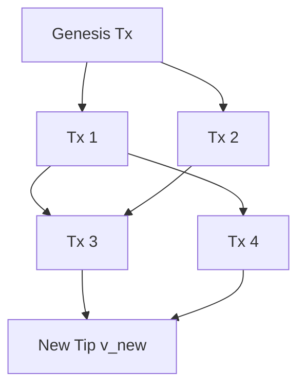

# Sikka: A Next-Generation Parallel, Feeless, and Quantum-Safe Digital Currency

## 1. Abstract
Sikka is a high-throughput, decentralized state machine designed for autonomous agents, machine-to-machine payments, and human users. It addresses the fundamental limitations of serialized blockchain architectures by utilizing a Directed Acyclic Graph (DAG) combined with an Unspent Transaction Output (UTXO) model. Sikka operates as a purely feeless, parallel-processing, quantum-safe, and Tor-native network. By replacing global synchronization with a localized, adaptive cryptographic puzzle, Sikka limits Sybil attacks and bounds network throughput without transaction fees or smart contract execution costs.

## 2. Executive Summary (TL;DR)
For readers requiring a high-level overview:
- **Zero-Fee Invariant:** The protocol mathematically enforces strict input-output equivalence, precluding the possibility of network fees.
- **Lock-Free Concurrency:** Sikka processes transactions as disjoint state transitions, allowing unbounded parallel execution.
- **Quantum-Resistant Cryptography:** Sikka utilizes NIST-standardized ML-DSA-87 to defend against polynomial-time quantum attacks (e.g., Shor's Algorithm).
- **Default Network Obfuscation:** Node topology and IP routing are secured via an integrated Tor hidden service architecture.
- **Asymptotic Energy Efficiency:** The network secures consensus with $\mathcal{O}(1)$ hashing complexity per node, diverging from the $\mathcal{O}(N)$ energy expenditure of global proof-of-work arrays.

## 3. Structural Limitations of Early Feeless DAGs
The architecture of Sikka derives from the theoretical limits encountered by early feeless DAG structures, notably the block-lattice model:

- **Sybil Vulnerability & Static Hash Puzzles:** Networks relying on static Proof of Work (PoW) exhibit poor fault tolerance under sustained Sybil attacks, resulting in state bloat. Sikka resolves this via an Adaptive Cryptographic Puzzle; the difficulty scalar $D$ increases exponentially relative to the localized temporal congestion.
- **Sequential Bottlenecks:** Block-lattice architectures enforce a single unified chain per account, resulting in sequential state transitions. Sikka's UTXO model permits unbounded parallelism for non-intersecting sets of UTXOs.
- **Lack of Post-Quantum Security:** Reliance on Ed25519 leaves legacy networks vulnerable to quantum decryption. Sikka natively integrates ML-DSA-87.
- **Clearnet Topologies:** Legacy nodes expose IP addresses, risking targeted DDoS attacks and deanonymization. Sikka relies on an implicit overlay routing network (Tor).

## 4. Disjoint State Transitions and Lock-Free Concurrency
Traditional blockchains (and block-lattice models) rely on an Account Model, which enforces strict serialization of state transitions. If a state $S$ is modified by transactions $T_1$ and $T_2$, they must be ordered sequentially to prevent race conditions ($Nonce_{T1} < Nonce_{T2}$).

Sikka adopts an **Unspent Transaction Output (UTXO)** model, fundamentally changing the concurrency paradigm. We define a transaction $T$ as a pure function mapping a set of input UTXOs $I$ to a set of output UTXOs $O$. 

Two transactions $T_1$ and $T_2$ are strictly disjoint and can be executed simultaneously on independent threads if and only if their input read sets do not intersect:
$$ I(T_1) \cap I(T_2) = \emptyset $$

Because each UTXO acts as an independent cryptographic bearer instrument, the node's validation engine does not require global mutex locks. The network achieves horizontal scalability bounded only by the host hardware's parallel processing capacity.

## 5. Core Architecture & Protocol Specification

### 5.1 Directed Acyclic Graph (DAG) Topology
Sikka dispenses with the concept of discrete blocks. The ledger is represented as a strictly directed acyclic graph $G = (V, E)$, where vertices $V$ represent transactions, and directed edges $E$ represent cryptographic parent references. Every newly broadcast transaction $v_{new}$ must append to the frontier of the DAG by referencing exactly two terminal nodes (tips) $\{p_1, p_2\} \subset V$.



A valid Sikka vertex (Transaction) requires:
- `Parents`: Two references defining edges in $E$.
- `Inputs` & `Outputs`: Enforcing the zero-sum invariant $\sum_{i \in I} value(i) = \sum_{o \in O} value(o)$.
- `PowNonce` & `PowBits`: The nonce satisfying the hash puzzle.
- `ParentPowHashes`: A commitment to the cryptographic state of $\{p_1, p_2\}$ during mining.

### 5.2 Adaptive Cryptographic Puzzle (Sybil Defense)
To prevent throughput saturation and unbounded graph inflation, Sikka employs an **Adaptive Cryptographic Puzzle**. Rather than a global difficulty adjustment, Sikka computes a localized congestion factor $C(v)$ by traversing the topological ancestors of the proposed transaction $v$ within a temporal window $W$ (e.g., $W = 60$ seconds).

```go
// Algorithm 1: Adaptive Puzzle Difficulty Calculation
function ComputeRequiredBits(tx):
    ancestors = TraverseAncestorsByTime(tx.Parents, window=60_seconds)
    tx_count = length(ancestors)
    
    if tx_count > BASE_THROUGHPUT:
        overflow_buckets = ceil((tx_count - BASE_THROUGHPUT) / BASE_THROUGHPUT)
        // Difficulty doubles for every overflow bucket
        return MIN_BITS + (overflow_buckets * 2)
    else:
        return MIN_BITS
```

As the transaction rate exceeds the designated boundary, the requisite hashing entropy grows exponentially. An adversary attempting to flood the network faces a geometric explosion in required computational cycles, enforcing strict rate-limiting without monetary fees.

### 5.3 Conflict Resolution and Asymptotic Probabilistic Finality
Because Sikka lacks a synchronized block leader, conflicting transactions (double-spends) may be broadcast simultaneously. Sikka guarantees consensus via **Asymptotic Probabilistic Finality**.

Each transaction accumulates a monotonic scalar `weight`, computed by the sum of all descendant vertices referencing it.

```go
// Algorithm 2: Monotonic Weight Propagation
function PropagateWeight(new_tx):
    queue = [new_tx.Parents]
    visited = {}
    
    while queue is not empty:
        node = queue.pop()
        if node not in visited:
            node.weight += 1
            visited.add(node)
            // Ceiling to bound memory complexity
            if node.weight < SATURATION_LIMIT:
                queue.push(node.Parents)
```

For any conflicting pair $\{T_A, T_B\}$ attempting to consume the same input set, nodes deterministically select the branch with the maximum cumulative weight. 
$$ Winner = \arg\max_{T \in \{T_A, T_B\}} Weight(T) $$
If $Weight(T_A) = Weight(T_B)$, a deterministic lexicographical sort of the transaction hashes breaks the symmetry. The probability of a state reversal decays exponentially as weight increases: $P(reversal) \propto e^{-\lambda \cdot W(T)}$.

### 5.4 Quantum-Safe Cryptography (ML-DSA-87)
Sikka achieves post-quantum security guarantees through the exclusive use of ML-DSA-87 (Module Lattice Digital Signature Algorithm). To prevent chosen-ciphertext and cross-context replay attacks, the signing payload involves strict deterministic domain binding.

```go
// Algorithm 3: Domain-Bound Signing Payload Construction
function ConstructPayload(tx, spent_utxo):
    prefix = bytes("sikka:v2:txinput")
    tx_hash = SHA3_256(tx.Body)
    return concat(prefix, tx_hash, spent_utxo.TxID, spent_utxo.Index, spent_utxo.Address)
```

### 5.5 Native Protocol-Level Multisig (M-of-N Thresholds)
Sikka implements $M$-of-$N$ threshold signatures natively without requiring Turing-complete execution environments. 

A multisig address is deterministically derived from a canonical sorted vector of ML-DSA-87 public keys and a scalar threshold $M$:
$$ Address = Bech32m(SHA3\_256(M \parallel PK_0 \parallel PK_1 \dots \parallel PK_N)) $$

Validation requires $\mathcal{O}(N)$ signature checks per input, strictly bounded by protocol constants to prevent resource exhaustion attacks during verification.

### 5.6 Airdrop Distribution & Network Incentives
Sikka maintains a strictly hardcoded maximal supply of $19,960,907 \times 10^{10}$ minimal base units (`chillar`). To bootstrap the network state, $100\%$ of the initial issuance is distributed via an automated, verifiable randomized selection algorithm targeting active full nodes holding the ledger state over the initial $T_0 + 6\ months$ epoch.

**Long-Term Asymptotic Incentives:**
Without transaction fees, network resilience relies on intrinsic, non-monetary utility functions:
1. **Commercial Finality:** Merchants run full nodes to ensure $\mathcal{O}(1)$ latency verification of incoming payments without reliance on third-party RPC relays.
2. **Data Availability:** Application developers require persistent read/write access to the global state matrix.
3. **Byzantine Fault Tolerance:** Privacy and censorship-resistance advocates contribute redundancy to the overlay network.

### 5.7 Integrated Onion Routing and P2P Overlay
Sikka obfuscates the physical IP topology of the network via a tightly coupled Tor daemon. The node deterministically generates an Ed25519 identity key, which mathematically derives a Tor Hidden Service (V3 `.onion` address). 

Nodes communicate via a multiplexed gossip protocol over encrypted Tor circuits. Because all incoming and outgoing connections traverse minimum 3-hop onion routes, the protocol achieves strong network-layer anonymity, making targeted Eclipse and DDoS attacks computationally intractable to execute against specific validators.

### 5.8 Topological Garbage Collection of Orphaned Subgraphs
To ensure the space complexity of the node remains strictly bounded (avoiding "ledger bloat"), Sikka employs active **Topological Garbage Collection**.

Once a conflict resolves and the winning transaction reaches the $SATURATION\_LIMIT$, the losing subgraph becomes mathematically orphaned. A background daemon executes a recursive post-order traversal to identify and safely deallocate these invalid vertices.

```go
// Algorithm 4: Subgraph Deallocation (Garbage Collection)
function PruneOrphanedSubgraph(losing_tx):
    stack = [losing_tx]
    while stack is not empty:
        node = stack.pop()
        for child in node.children:
            stack.push(child)
        Database.Delete(node) // Space Complexity O(1) per node
```
Furthermore, fully consumed historical UTXOs are stripped of their signature payloads, reducing their memory footprint to a minimal cryptographic hash necessary for preserving topological ancestry.

### 5.9 Light Clients & Simplified Sync API
Light clients achieve $SPV$ (Simplified Payment Verification) guarantees by exclusively downloading subgraphs related to their known public keys. By querying the `/v1/sync/tail` endpoint, a light client verifies the cumulative weight of its relevant tips, trusting the probabilistic finality model without storing the global state matrix $V$.

## 6. Asymptotic Energy Complexity & Sustainability
Legacy Proof of Work protocols rely on global hash rate competition, resulting in an energy expenditure that scales linearly with the network's aggregate computational hardware ($\mathcal{O}(N)$ global energy waste). 

Sikka decouples consensus from block production. Its localized adaptive PoW serves purely as an anti-Sybil rate-limiter. Under non-congested conditions, processing a transaction requires a fixed, constant $\mathcal{O}(1)$ energy expenditure (approximately 4 iterations of SHA3-256). This bounded constraint ensures the network operates sustainably, permitting low-power edge devices (IoT, smartphones) to participate fully without degrading overall state machine security.

## 7. Mathematical Security & Attack Vectors
- **Sybil / Spam Flooding:** As detailed in Algorithm 1, the computational cost to sustain an injection rate $R > BASE\_THROUGHPUT$ grows exponentially. An adversary's required energy vector scales out of bounds within minutes, rendering sustained flooding economically unviable.
- **Pre-computation (Selfish Mining) Attacks:** The PoW hash rigidly commits to the dynamic state of the DAG tips (`ParentPowHashes`). Pre-computed subgraphs immediately invalidate when the honest network's topological frontier advances, neutralizing selfish mining without requiring continuous energy expenditure.

## 8. The Case Against Turing Completeness
Sikka deliberately omits a Turing-complete state transition language (e.g., EVM). Turing completeness fundamentally introduces the Halting Problem, necessitating strict, monetized execution bounds (Gas fees) to prevent infinite loops. By restricting state transitions to deterministic, finite cryptographic validations (UTXO summation, signature verification), Sikka guarantees halting natively. This structural constraint enables the strictly zero-fee paradigm.

## 9. Conclusion
Sikka resolves the fundamental limits of serialized consensus networks by fusing a parallel UTXO DAG structure with localized, adaptive cryptographic puzzles. By discarding global block synchronization, monetized execution environments, and legacy cryptography, Sikka achieves lock-free concurrency, asymptotic probabilistic finality, and post-quantum resilience, establishing a mathematically rigorous substrate for decentralized value transfer.
