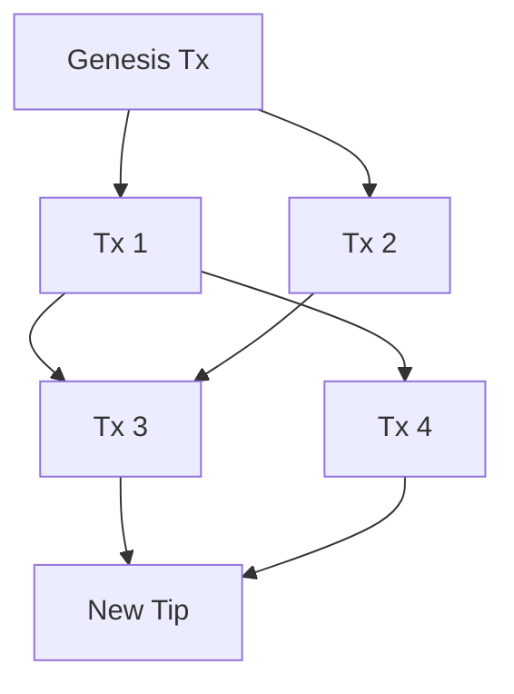

# Sikka: A Next-Generation Parallel, Feeless, and Quantum-Safe Digital Currency

## 1. Abstract
Sikka is a lightweight, high-performance digital currency built for humans, autonomous agents, and machine-to-machine payments. It breaks away from traditional blockchain constraints by utilizing a Directed Acyclic Graph (DAG) architecture combined with an Unspent Transaction Output (UTXO) model. Sikka operates as a purely feeless, parallel-processing, quantum-safe, and Tor-native network. There are no miners, no block queues, and no smart contract gas fees. Instead, the network scales dynamically with an adaptive, localized Proof of Work mechanism designed explicitly to thwart spam while keeping legitimate transactions free.

## 2. Executive Summary (TL;DR)
For those short on time, here is why Sikka exists and why it matters:
- **Zero Fees, Forever:** It is mathematically impossible to charge fees on the Sikka network. Every transaction is completely free.
- **True Parallelism:** Unlike traditional blockchains (Bitcoin, Ethereum) or even early DAGs (Nano) that process transactions sequentially, Sikka processes independent transactions simultaneously on parallel threads.
- **Quantum-Proof Security:** Protected by NIST-standardized ML-DSA-87 cryptography, meaning Sikka is secure against future quantum computer attacks.
- **Built-in Privacy:** The node software comes with zero-config Tor built directly into it. IP addresses and physical locations are hidden by default.
- **Energy Efficient:** A standard transaction requires merely ~4 hashes to process, meaning it takes exponentially less energy than traditional proof-of-work systems.

## 3. The Genesis: Frustrations with Nano and the Path to Sikka
The creation of Sikka was heavily motivated by the frustrations and limitations encountered with early feeless DAG cryptocurrencies, most notably Nano. While Nano pioneered the vision of feeless and instant digital money, its implementation revealed several structural flaws at scale:

- **Spam Vulnerability & Static PoW:** Nano historically relied on a static Proof of Work and struggled heavily with spam attacks that bloated the ledger and degraded network performance. Its subsequent fixes involved complex prioritization schemas that compromised the simplicity of the protocol. Sikka solves this gracefully: instead of fees, every transaction requires a localized PoW that dynamically scales with network congestion. As load increases, the hashing requirement grows exponentially, making spam economically and computationally ruinous for attackers while remaining negligible for normal users.
- **Sequential Bottlenecks (Block-Lattice):** Nano's block-lattice architecture requires each account to have its own blockchain. This means multiple transactions from or to the same account must be processed sequentially. Sikka discards the block-lattice in favor of a true UTXO DAG. Independent UTXOs can be spent entirely in parallel, even by the same user, removing all throughput ceilings.
- **Lack of Quantum Security:** Nano uses Ed25519 signatures, which are vulnerable to future quantum computing attacks (Shor's algorithm). Sikka is built from the ground up to be quantum-safe, exclusively using NIST-standardized ML-DSA-87 (Module Lattice Digital Signature Algorithm).
- **Network Privacy:** Nano operates on the clearnet, exposing node IP addresses. Sikka is Tor-native, routing all node communication privately via `.onion` addresses.
- **Smart Contract & Multisig Limitations:** Nano lacks native multisig. Sikka introduces native M-of-N threshold signatures at the protocol level without requiring gas-heavy smart contracts.

## 4. A User Journey: How Sikka Works in Practice
To understand the power of Sikka, let's look at a simple example involving Alice buying a coffee.

1. **The Wallet:** Alice opens her Sikka mobile wallet. She wants to buy a coffee ($5) and split dinner with Bob ($20).
2. **True Parallelism:** In Ethereum or Bitcoin, Alice must wait for the coffee transaction to clear before she can pay Bob. Because Sikka treats her digital coins like physical bills in her wallet (UTXOs), she can hand the barista a $10 bill and hand Bob a $20 bill at the exact same moment. Both transactions are processed in parallel without waiting on each other.
3. **No Hidden Fees:** When Alice sends $5, the barista receives exactly $5. Not $4.95. Not $4.00.
4. **Instant Finality:** Within seconds, the barista's node confirms the transaction is overwhelmingly valid. Alice takes her coffee and leaves, all without either party interacting with a miner or block producer.

## 5. Core Architecture & Technical Implementation

### 5.1 Parallel Transaction DAG & UTXO Model
Sikka abandons blocks entirely. The base data structure of the network is the `Transaction`. Because there are no block producers or mempool queues, every submitted transaction immediately becomes part of the graph and serves as a tip for future transactions.


*(Above: Each new transaction acts as a tip that references two previous transactions, braiding them together into a unified, directionally flowing graph).*

A Sikka transaction contains:
- `Parents`: Exactly two parent transaction IDs, referencing the current DAG frontier.
- `Inputs` & `Outputs`: An exact UTXO ledger where the sum of input values exactly matches the output values (enforcing the strictly feeless design).
- `PowNonce` & `PowBits`: The proof-of-work solution.
- `ParentPowHashes`: Hex-encoded SHA3-256 PoW hashes of the parent transactions at the time of mining.
- `Timestamp`: Unix timestamp to prevent future-dating skew.

**Why a UTXO Model over an Account Model?**
Most modern feeless networks (like Nano) and smart-contract networks (like Ethereum) use an Account-based model. In an account model, users have a single balance, and transactions from that account must be strictly sequenced (via nonces or a single account blockchain) to prevent double-spending. This introduces a fundamental sequential bottleneck.

Sikka uses an **Unspent Transaction Output (UTXO) model**, treating funds like discrete bills of physical cash rather than a unified bank account balance. 

```mermaid
graph LR
    subgraph Account Model (Sequential Processing)
        A1[Alice's Unified Balance] -->|Wait| B1[Tx 1: Coffee]
        B1 -->|Wait| C1[Tx 2: Bob]
    end
    subgraph UTXO Model (Parallel Processing)
        U1[Alice's UTXO: $10] --> T1[Tx 1: Coffee]
        U2[Alice's UTXO: $20] --> T2[Tx 2: Bob]
    end
```

- **True Parallelism (The Bottleneck vs. The Cash Model):** Independent inputs can be broadcast simultaneously. They process in parallel on entirely different network threads with zero queuing.
- **Enhanced Privacy:** The UTXO model naturally discourages address reuse. When Alice buys the $5 coffee with her $50 UTXO, the transaction generates a $45 "change" output. Alice can route this change to a brand-new, stealthy address. This obfuscates her total wealth from public view, whereas a static Account balance broadcast to the world is easily tracked.
- **Enforced Feeless Math:** Because the protocol strictly mandates that `sum(inputs) == sum(outputs)`, it is mathematically impossible to charge a fee. The feeless invariant is hardcoded into the consensus layer itself. You simply cannot skim a fee off a UTXO without failing the equality check.

### 5.2 Dynamic Adaptive Proof of Work & Spam Defense
Instead of a fee market, Sikka throttles spam through its `RequiredPowBits` algorithm. The required SHA3-256 PoW difficulty scales dynamically based on the live network load in the last 60 seconds (`PowCongestionWindowSeconds`).

```go
// Pseudocode: Adaptive PoW Difficulty Calculation
recent_tx_count = scan_ancestors_in_last_60_seconds(tx)
if recent_tx_count > 60 {
    extra_buckets = ceil((recent_tx_count - 60) / 60)
    required_bits = 2 + (extra_buckets * 2)
} else {
    required_bits = 2
}
```

Under normal conditions, a transaction requires only a baseline difficulty (e.g., 2 bits, ~4 hashes). However, Sikka scans the DAG for the recent ancestor count. If this count exceeds `PowCongestionBucketTransactions` (60 tx), an extra `PowCongestionBucketBits` (2 bits) is added for every bucket. This means each additional load bucket multiplies the required hashing power by 4x. 

**Tip Commitment (Selfish Mining Defense):** 
The Sikka PoW hash explicitly binds to `ParentPowHashes` (`[32]byte` arrays of the live tips) along with the `pow_nonce` and `txID`. An attacker cannot pre-mine a flood of transactions offline because the parent PoW hashes must exactly match the state of the live network when the transaction is submitted. If the network moves forward, the attacker's pre-mined PoW becomes instantly invalid. 

```go
// Pseudocode: Tip Commitment and PoW Validation
pow_input = tx.ID + parent[0].PowHash + parent[1].PowHash + tx.PowNonce
pow_hash = SHA3_256(pow_input)

if leading_zero_bits(pow_hash) < required_bits {
    reject_transaction()
}
```

This, combined with a **600-second UTXO maturity rule**, makes rapid-fire transaction chain spam mathematically and chronologically unfeasible.

### 5.3 Conflict Resolution & Probabilistic Finality
In the event of a double spend, Sikka does not instantly reject either transaction. Instead, conflict resolution operates deterministically across all nodes via cumulative weight.

Each transaction accumulates weight (`propagateWeightLocked`) based on the transactions that build upon it. Weight propagates upward to ancestors monotonically, capped by a saturation limit (`weightSaturationFactor * confirmationThreshold`, typically 3200) to ensure bounded memory and deterministic propagation logic.

When evaluating an outpoint claimed by multiple spends, nodes use `spendCandidateBetter()`. The candidate with the highest cumulative weight wins. If weights are tied, Sikka uses lexicographical sorting of the transaction IDs to guarantee that every independent node converges on the exact same canonical ledger state (`canonicalSpenderLocked`).

```go
// Pseudocode: Canonical Spend Conflict Resolution
func spendCandidateBetter(txA, txB):
    weightA = cumulative_weight(txA)
    weightB = cumulative_weight(txB)
    
    if weightA != weightB {
        return weightA > weightB  // Heaviest path wins
    }
    return txA.ID < txB.ID        // Deterministic tie-breaker
```

### 5.4 Quantum-Safe Cryptography (ML-DSA-87)
Sikka is secured entirely by the NIST-standardized ML-DSA-87 post-quantum signature scheme. 
- **Deterministic Domain Binding:** To prevent cross-context replay attacks, every signature commits to the exact context via a domain prefix (`"sikka:v2:txinput"`), along with the spent `txID`, `index`, `value`, and `address`. 

```go
// Pseudocode: Cryptographic Signing Payload
signing_payload = concat(
    "sikka:v2:txinput",
    SHA3_256(tx.Body),
    input.Index,
    spent_utxo.TxID,
    spent_utxo.Index,
    spent_utxo.Value,
    spent_utxo.Address
)
```

### 5.5 Native Protocol-Level Multisig (M-of-N Thresholds)
Unlike traditional networks that rely on complex, gas-heavy smart contracts to manage joint-custody accounts, Sikka implements M-of-N multisig natively at the protocol level.

- **Deterministic Address Derivation:** A Sikka multisig address is not a contract. It is mathematically derived from a threshold policy and a canonical, sorted list of ML-DSA-87 public keys. The descriptor looks like `"mldsa87:<threshold>:[<pk_0>,<pk_1>,...]"`. This descriptor is hashed and encoded directly into a `bech32m` address. Single-sig addresses are simply treated as the degenerate case of a 1-of-1 threshold policy.

```go
// Pseudocode: Threshold Address Derivation
sort(public_keys)
policy_descriptor = "mldsa87:" + threshold + ":[" + join(public_keys, ",") + "]"
address_payload = SHA3_256(version_byte + policy_descriptor)
address = bech32m_encode("sikka", address_payload)
```

- **The `ThresholdWitness` Structure:** When spending from a multisig address, the transaction uses a `ThresholdWitness` data structure. This structure must present the identical sorted list of public keys used to generate the address, alongside an array of signatures.
- **Gas-Free Execution:** Because the validation logic (verifying that the number of valid signatures meets or exceeds the `<threshold>`) is baked directly into the node's core Go consensus rules (in `verifyInputWitness`), setting up and executing a multisig transaction costs absolutely zero fees.

```go
// Pseudocode: Gas-Free Multisig Validation
valid_sigs = 0
for i, sig in enumerate(witness.signatures):
    if sig != empty:
        if verify_mldsa87(witness.public_keys[i], sig, signing_payload):
            valid_sigs++

if valid_sigs < witness.threshold:
    reject_transaction()
```

### 5.6 Total Supply, Airdrop Distribution & Nomenclature
The name **Sikka** traces its roots back to the Indian Golden Age, where the term historically referred to a minted coin of high value and trust. Honoring this legacy of foundational money, the native currency of the network utilizes specific terminology to differentiate quantities:
- **SIKKA:** The singular base unit (e.g., "1 SIKKA").
- **SIKKE:** The plural form of the base unit (e.g., "50 SIKKE").
- **CHILLAR:** The smallest indivisible decimal unit of the currency, analogous to Satoshis in Bitcoin or Wei in Ethereum. 1 SIKKA is composed of 10,000,000,000 (10^10) CHILLAR.

Sikka features a strictly fixed total supply of `19,960,907 * 10^10 chillar` (encoding the founder's birthday, 1996-09-07). Instead of an ICO or developer allocation, **100% of the supply will be distributed via an airdrop exclusively to node operators**.

The airdrop phase automatically triggers when the DAG reaches a total size of 100 transactions and runs continuously for exactly 6 months.

**The Node Reward Algorithm:**
The airdrop distributes funds by incentivizing full nodes to retain the ledger. The network randomly selects a node from the active pool and challenges it to provide data for 7 random transactions from the DAG's history. If the node successfully validates and returns the true transactions, it is rewarded.

```go
// Pseudocode: Node Operator Airdrop Reward Algorithm
func process_airdrop():
    if dag.size() < 100 or time_since_start() > 6_months:
        return  // Airdrop inactive
    
    selected_node = random_choice(active_node_pool)
    challenge_txs = select_random_transactions(dag, count=7)
    
    if selected_node.can_validate_and_prove(challenge_txs):
        reward_node(selected_node)
```

**Long-Term Node Incentives:**
A common question in feeless networks is: *"If there are no miner fees, why run a node after the airdrop?"* Sikka node operators are intrinsically motivated rather than fee-motivated:
1. **Merchants & Exchanges:** A business accepting Sikka runs a node to verify their own payments trustlessly and instantly, bypassing the 2-3% processing fees of traditional credit cards.
2. **DApp & Wallet Providers:** Service providers need reliable ledger access to serve their application's userbase.
3. **Privacy Advocates:** Enthusiasts run nodes via Tor to support and route a resilient, censorship-resistant network.

### 5.7 Tor-Native Networking & Zero-Config Embedded Tor
All nodes communicate exclusively via Tor `.onion` addresses, keeping node IP addresses and network topology completely hidden. 

Unlike other privacy networks that force users to manually configure a Tor daemon, Sikka features a **Zero-Config Embedded Tor**. The Sikka node automatically launches, configures, and manages its own internal Tor process. It deterministically generates an onion hidden service from the node's Ed25519 seed and handles all proxy routing under the hood. For the user, privacy is automatic and frictionless out of the box.

Because Sikka operates a general DAG, synchronization is extremely fast. Nodes use a single round-trip `sync_v1` protocol where a node sends a sparse "have" list, and the peer computes the precise missing DAG diff via ancestor-closure math.

### 5.8 Storage Efficiency & Dead-Branch Pruning
A major criticism of DAG architectures (like Nano) is "ledger bloat"—the idea that every transaction stays in the database forever, making nodes increasingly expensive to run.

Sikka solves this with active **Dead-Branch Pruning**. When a double-spend conflict occurs and the network converges on a canonical winner (reaching the confirmation threshold of 200 weight), the losing transaction is not just ignored. Once a grace period expires, Sikka's pruning engine (`PruneLosingConflicts()`) actively traverses the DAG and completely deletes the losing transaction and its entire subtree of descendants from the database. Furthermore, fully spent historical transactions are pruned of their bulky data payloads, retaining only their cryptographic hashes to maintain structural integrity. This keeps the Sikka node footprint incredibly lightweight (able to run in a <20MB Docker container).

### 5.9 Light Clients & Simplified Sync API
Sikka provides native support for Simplified Payment Verification (SPV) style light clients. Mobile wallets and constrained devices do not need to download the entire DAG. Instead, they utilize the `/v1/sync/tail` API to fetch filtered, cryptographically verifiable transaction histories. Light clients only download the branch of the DAG relevant to their specific UTXOs, relying on the cumulative weight attached to the tips to trustlessly verify consensus finality without maintaining a full node.

## 6. Environmental Impact & Sustainability
Unlike traditional Proof of Work (PoW) consensus algorithms that require warehouse-scale ASIC mining farms consuming the energy of small countries, Sikka’s PoW is radically different. Sikka utilizes an ultra-lightweight, localized PoW as a spam deterrent, not as a block-minting mechanism. 

Under normal network conditions, confirming a transaction requires only a baseline difficulty of ~4 hashes. This calculation can be performed instantly on a smartphone without noticeably draining the battery. By completely decoupling security from energy expenditure, Sikka offers an incredibly green, sustainable alternative that achieves global consensus without a massive carbon footprint.

## 7. Mathematical Security & Attack Vectors
Sikka's consensus is secured by probabilistic finality rather than deterministic block height. A transaction is considered final when its cumulative weight exceeds a threshold (`confirmationThreshold = 200`).

- **51% Sybil Attack & Spam Flooding:** In legacy systems, spam is deterred by fees. In Sikka, an attacker attempting to flood the network to outpace honest weight will trigger the `RequiredPowBits` scaling algorithm. As their transaction count increases, the required hashing power per transaction multiplies exponentially (4x every 60 txs/minute). What starts as an easy 4-hash proof rapidly becomes mathematically impossible to sustain, pricing the attacker out in electricity and hardware without affecting the baseline difficulty for normal users.
- **Selfish Mining / Pre-computation Attacks:** An attacker cannot pre-mine a heavy malicious branch offline and suddenly broadcast it. Because the PoW explicitly commits to `ParentPowHashes` (the live tips of the DAG), the attacker's pre-computed hashes instantly become invalid the moment the honest network advances. The attacker is forced to constantly re-mine against a moving target, which is impossible without >50% of the total network hash rate.

## 8. The Case Against Turing Completeness
While platforms like Ethereum focus heavily on Turing-complete smart contracts, Sikka deliberately omits them. Smart contracts introduce massive attack surfaces (re-entrancy, logic bugs) and unpredictable state transitions. More importantly, Turing-complete execution is subject to the Halting Problem—meaning a network *must* charge gas fees to prevent infinite loops. 

By rejecting Turing completeness, Sikka guarantees execution limits natively. Features that usually require complex, gas-heavy smart contracts—like M-of-N Multisig—are instead baked directly into the node's core consensus rules in Go. This is how Sikka remains unconditionally feeless and parallel, trading unbounded computation for absolute speed, security, and predictability.

## 9. Practical Use Cases for Feeless, Instant Consensus
Because Sikka eliminates block queues and transaction fees, it unlocks operational paradigms that are fundamentally impossible on traditional blockchains:

- **Machine-to-Machine (M2M) Micro-payments:** IoT devices, autonomous AI agents, and automated APIs can pay each other fractions of a cent instantly. On a traditional blockchain, a $0.001 payment is impossible if gas fees are $5. Sikka's 10-decimal precision (`chillar`) allows for pure, frictionless M2M economies.
- **Global Point-of-Sale (PoS) Commerce:** Merchants can accept Sikka at physical checkouts natively. Transactions confirm in seconds (probabilistic finality threshold = 200 weight), allowing the customer to leave immediately, while the merchant keeps 100% of the sale by bypassing the 2-3% tax of legacy credit card processors.
- **Privacy-First Remittances:** Because Sikka routes exclusively over Tor (`.onion`), users operating in hostile or highly surveilled jurisdictions can transmit value peer-to-peer globally without exposing their IP addresses or physical locations to the clearnet.
- **Gas-Free Joint Treasuries:** Decentralized organizations or joint ventures can leverage the native M-of-N threshold signatures to manage shared funds. Unlike Ethereum, where executing a multisig requires deploying a contract and paying gas for every participant's signature, Sikka handles this at the protocol level for free.

## 10. Why Sikka is the Best (Sikka vs. The Rest)

| Feature | ⚡ Sikka | ⛓️ Traditional (BTC/ETH) | 🥦 Nano |
|---|---|---|---|
| **Architecture** | Parallel UTXO DAG | Sequential Blocks | Block-Lattice (Sequential per account) |
| **Fees** | Absolutely Zero | Variable/High Gas | Zero |
| **Spam Defense** | Localized, Congestion-Adaptive PoW + Tip Commitment + Maturity | High fees price out spam | Static PoW / Complex QoS prioritization |
| **Cryptography** | Quantum-Safe (ML-DSA-87) | Classical (ECDSA) | Classical (Ed25519) |
| **Multisig** | Native Protocol-Level | Smart Contracts (Costs Gas) | N/A |
| **Networking** | Zero-Config Tor (Private) | Clearnet (Public IPs) | Clearnet (Public IPs) |

## 11. Future Roadmap
The Sikka vision extends well beyond its initial launch. Key milestones include:
- **Phase 1: Mainnet Ignition & Airdrop.** The initial 6-month period where nodes synchronize, the ledger solidifies, and early adopters receive Sikka for validating network history.
- **Phase 2: Mobile & Light Client Deployment.** Release of SPV-style mobile wallets for iOS and Android, allowing users to send and receive Sikka via Tor without downloading the whole DAG.
- **Phase 3: Merchant Tooling & POS APIs.** Developing plug-and-play integrations for point-of-sale systems, enabling instant, feeless checkout for physical stores.
- **Phase 4: IoT & Autonomous Agent Integration.** SDKs tailored for low-resource environments, enabling AI agents and connected devices to perform micro-payments natively.

## 12. Glossary of Terms
- **DAG (Directed Acyclic Graph):** A mathematical structure where data points are connected in a single direction without looping back. In Sikka, transactions link directly to each other instead of being grouped into sequential blocks.
- **UTXO (Unspent Transaction Output):** Think of UTXOs like physical cash. Instead of one total account balance, your wallet holds individual digital "bills" that you spend and receive change for.
- **Probabilistic Finality:** The concept that as more transactions build on top of your transaction (accumulating weight), the mathematical probability of it being reversed approaches zero, allowing for near-instant confirmations.
- **ML-DSA-87:** A cutting-edge cryptographic signature algorithm standardized by NIST to be secure against future quantum computers.
- **Tor-Native:** Built specifically to route internet traffic through the Tor anonymity network by default, obscuring IP addresses and physical locations.

## 13. Conclusion
Sikka was forged from the frustrations of previous feeless networks failing under load or architectural bottlenecks. By combining a parallel UTXO DAG, congestion-adaptive PoW tied to a tip commitment mechanism, zero-config Tor-native privacy, and bleeding-edge quantum-safe cryptography, Sikka realizes the original dream of a truly scalable, feeless, and future-proof digital currency. Sikka is the lightweight, parallel scale solution the crypto world has been waiting for.
